# SOC/SIEM Home Lab: Despliegue y Monitoreo con Wazuh

## Objetivo del Proyecto
El propósito de este laboratorio es simular amenazas controladas y auditar un entorno seguro y aislado utilizando el ecosistema de Wazuh (SIEM/XDR).

## Arquitectura de Red y Topología
El laboratorio se encuentra desplegado de forma local mediante virtualización, segmentado en una red interna privada.

* **PC Anfitrión (Host):** Windows 11 | IP: `192.168.1.8`
* **Orquestador de Red:** Servidor DHCP personalizado en VirtualBox (`CyberStudyLab`) | Segmento: `192.168.3.0/24`
* **SIEM Manager:** Wazuh Open Virtual Appliance (OVA) | IP Interna: `192.168.3.2`
* **Entorno de Evaluación (Atacante):** Kali Linux | IP: `192.168.3.4`
* **Objetivo de Auditoría (Víctima):** Ubuntu 26.04 LTS | IP: `192.168.3.3`

---

## Aislamiento e Infraestructura de Red

### 1. Orquestación del Segmento de Red Privado
Para garantizar que el tráfico de estrés y explotación no interfiera con la red LAN común, se creó un servidor DHCP dedicado mediante la CLI de VirtualBox (`VBoxManage`) en la maquina Host:

`bash`
`VBoxManage dhcpserver add --network=CyberStudyLab --server-ip=192.168.3.1 --netmask=255.255.255.0 --Lower-ip=192.168.3.2 --upper-ip=192.168.3.254 --Enable`

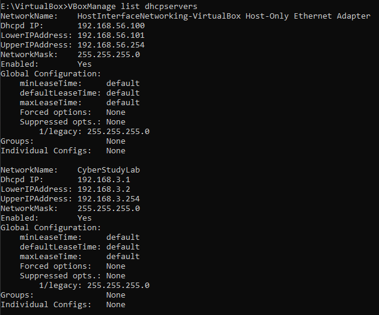

### 2. Vinculación de Interfaces en el Hipervisor

Cada una de las tres máquinas virtuales es asociada manualmente a la interfaz de aislamiento interna creada.

La maquina victima Ubuntu será la unica con conexión a internet para el Setup del Agente Wazuh

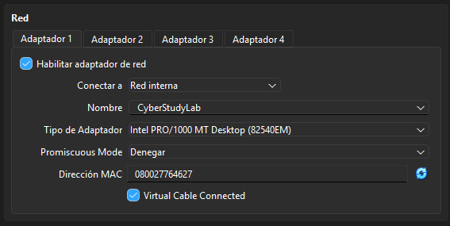

Cable Conectado: Permite al hardware virtual simular la conexión física, habilitando que los demonios de red de cada S.O. soliciten direccionamiento al DHCP de VirtualBox.

### 3. Despliegue del Servidor SIEM (Wazuh Manager)
Se procede con la importación del OVA oficial de Wazuh. Este nodo centralizará la recolección de eventos y las alertas del laboratorio.

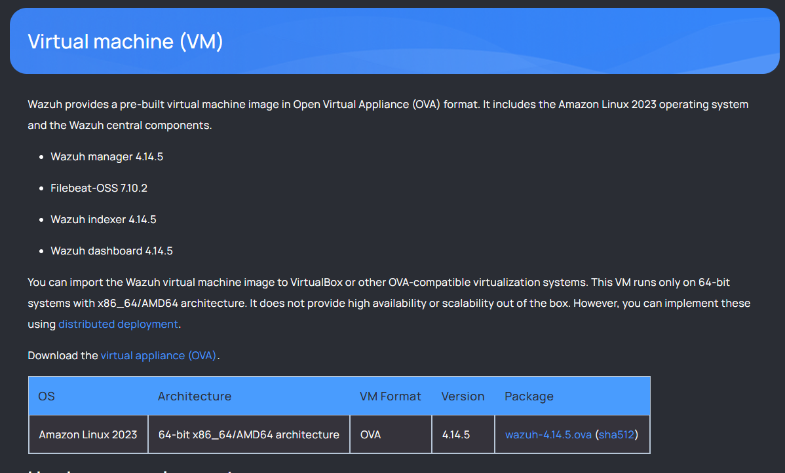

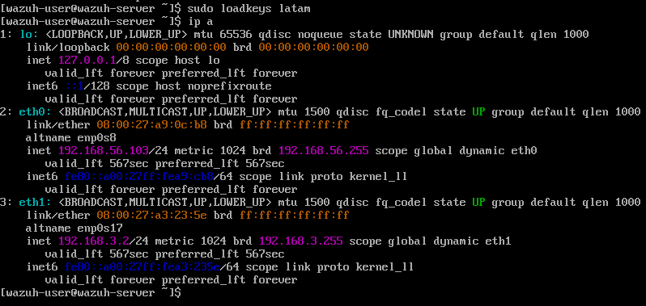

### 4. Configuración del Entorno de Evaluación (Atacante)
Se despliega una máquina virtual con Kali Linux.

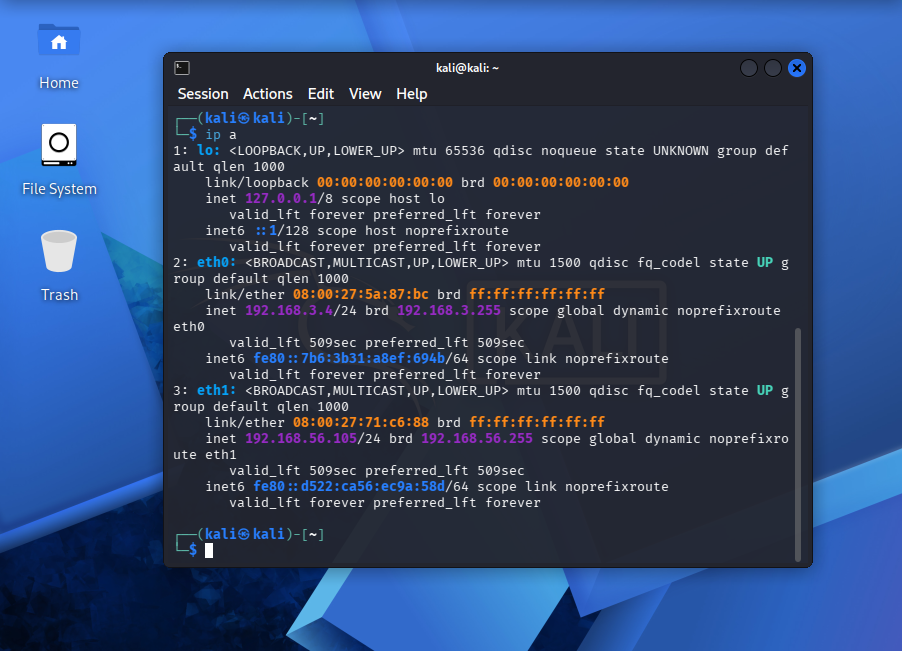

### 5. Configuración del Objetivo de Auditoría (Víctima)
Se inicializa un entorno con Ubuntu 26.04 LTS Desktop.

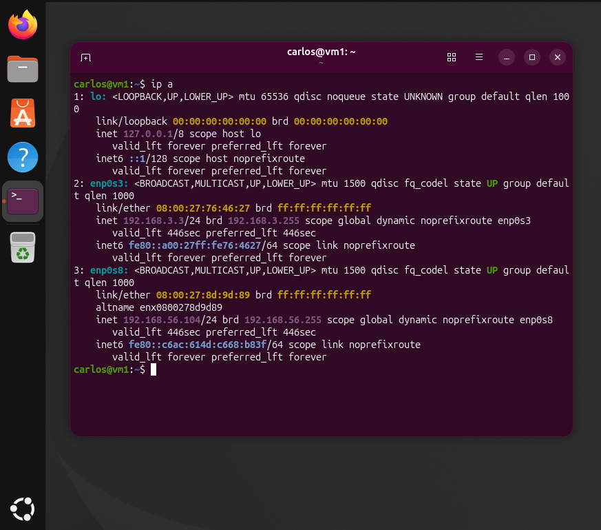

## Despliegue de Agentes e Inventario de Servicios

### 1. Instalación del Agente de Monitoreo en Ubuntu 26.04 LTS

Desde el panel web de Wazuh, generamos el script de despliegue automatizado para Linux. Iniciamos sesión en la máquina víctima de Ubuntu y ejecutamos los siguientes comandos por consola para descargar, configurar y levantar el servicio del agente:

`wget https://packages.wazuh.com/4.x/apt/pool/main/w/wazuh-agent/wazuh-agent_4.14.5-1_amd64.deb && sudo WAZUH_MANAGER='192.168.3.2' WAZUH_AGENT_NAME='UbuntuAgent' dpkg -i ./wazuh-agent_4.14.5-1_amd64.deb`

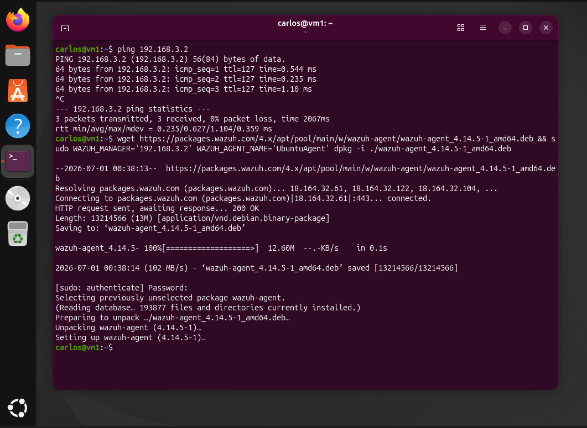

`sudo systemctl daemon-reload`
`sudo systemctl enable wazuh-agent`
`sudo systemctl start wazuh-agent`

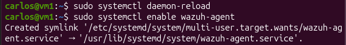

Validamos en endpoints-summary el estado del agente.

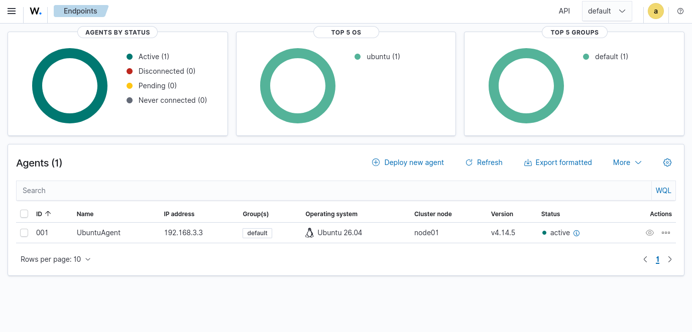

## Simulación de Amenazas (Servidor Web)

### Despliegue del Servicio Web y Ataque de Denegación de Servicio (DoS)

Para esta simulación instalamos y levantamos un servidor web Nginx en nuestro nodo de Ubuntu 26.04 LTS:

`sudo apt update && sudo apt install nginx -y`
`sudo systemctl start nginx`

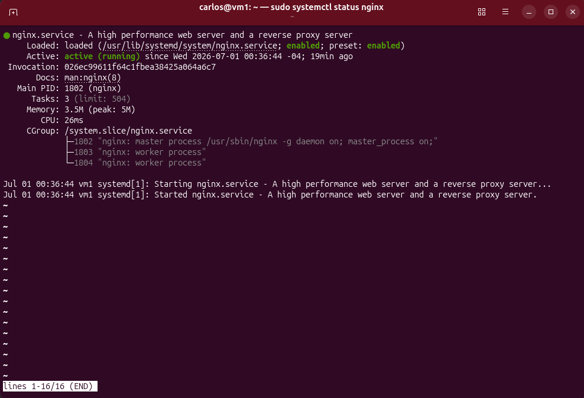

Con el puerto 80 (HTTP) expuesto en la red interna, podemos realizar una prueba de estrés para simular un ataque de denegación de servicio (DoS) por inundación HTTP, utilizando la herramienta slowhttptest desde Kali Linux:

`slowhttptest -c 1000 -H -g -o slow_result -i 10 -r 200 -t GET -u http://192.168.3.3`

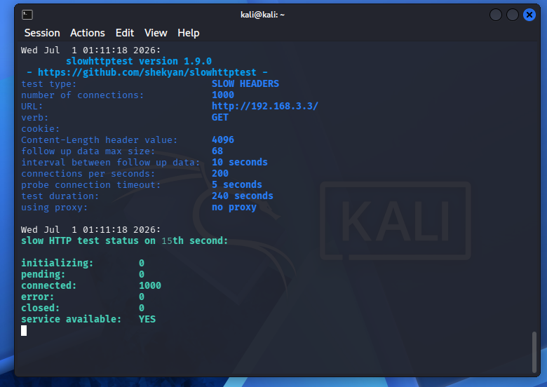

`-c 1000`: Abre 1,000 conexiones concurrentes simultáneas hacia tu servidor Ubuntu.  

`-H`: Especifica que el ataque será en modo Slow Read/Slow Header. Kali comenzará a enviar las cabeceras HTTP (GET / HTTP/1.1) pero extremadamente lento, un byte cada ciertos segundos.  

Nginx, al recibir una petición legítima, deja un hilo de conexión abierto esperando que el cliente termine de enviar la información antes de cerrar la sesión por timeout. Al tener muchas conexiones abiertas que no terminan de enviar sus datos, se agota la tabla de conexiones máximas permitidas.

`-i 10 -r 200`: Envía 200 conexiones por segundo (-r 200) y espera intervalos de 10 segundos (-i 10) para mantener los hilos ocupados de forma indefinida.

### Visualización en panel de monitoreo

En total se enviaron 2000 peticiones al ejecutarse el ataque simulado 2 veces. En la siguiente imagen vemos los resultados:

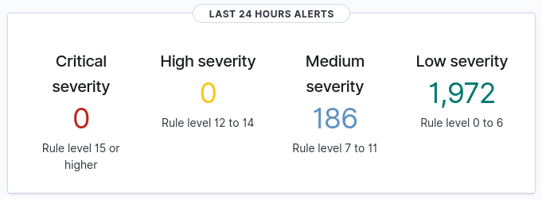

Vemos con detalle el log de la alerta:

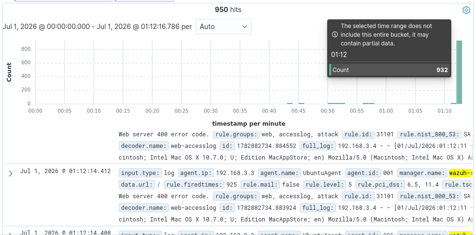

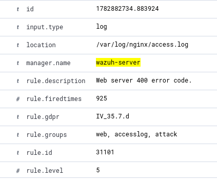

## Conclusiones y Aprendizajes

* Efectividad del Sandbox: La segmentación mediante redes internas demostró ser una solución robusta y segura para aislar las simulaciones y permitir un desarrollo estructurado del laboratorio.

* Visibilidad en Tiempo Real: El despliegue del agente de Wazuh en sistema operativo Ubuntu 26.04 LTS permitió mapear con total precisión los eventos a nivel de servidor web.

* Estrategia de Afinamiento (Reducción de Ruido): El ataque de estrés evidenció que las reglas por defecto generan una saturación de logs repetitivos en el panel. El camino a seguir consiste en el desarrollo de reglas condicionales en Wazuh para agrupar estas alertas masivas, disminuyendo el ruido operacional.

